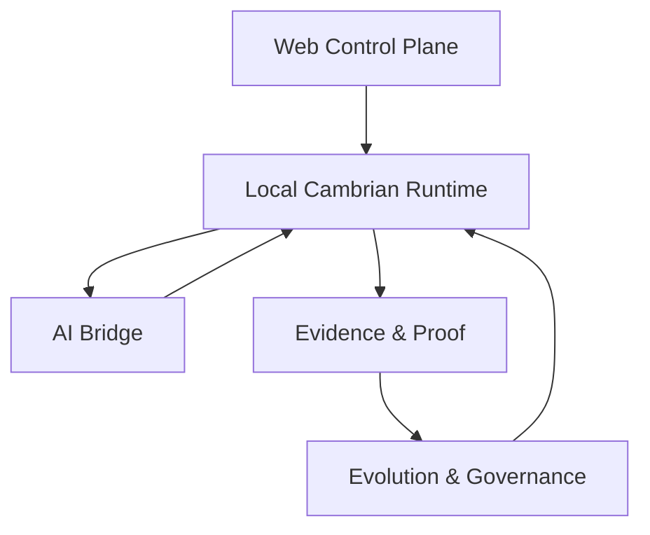

# Cambrian System Architecture

## 166R Architecture Identity

Cambrian is an installable AI company runtime.

Architecture summary:

```text
Human product goal
-> project-local AI company
-> harness operating system
-> generated workforce
-> generated skills
-> authority profile
-> boardroom decision
-> auto execution plan
-> validation and release gate
-> evidence-based evolution
```

Claude, Codex, Cursor, GPT, and local models are execution engines. Cambrian is the company runtime installed around those engines: it defines roles, skills, authority, validation, evidence, and evolution inside the project.

Preset packs are optional seed templates and internal distribution units. They are not the default product identity.

## 1. 목적

Cambrian의 아키텍처는 한 문장으로 요약된다.

**웹은 AI 일꾼을 고용하고 설치 대상을 고르는 control plane이고, 로컬 Cambrian은 그 일꾼을 실제 프로젝트에 설치·배치·검증·진화시키는 runtime이다.**

정식 경계 표현은 **Web control plane vs Local Cambrian runtime** 이다.

Cambrian은 모델 자체를 대체하지 않는다.
Cambrian은 사용자가 이미 쓰는 AI 위에 **작업복과 일꾼 묶음**을 입히는 시스템이다.

외부 제품 경험은 다음과 같다.

* 사용자는 필요한 AI 일꾼 또는 작업반을 고른다.
* Cambrian이 그것을 로컬 프로젝트에 설치한다.
* 사용자는 자기 AI에서 Cambrian을 불러와 일을 시킨다.
* Cambrian은 결과를 검증하고, 증거를 쌓고, 더 나은 기본값으로 진화시킨다.

내부적으로 Cambrian은 **하네스 엔지니어링 runtime** 이다.
외부적으로 Cambrian은 **AI worker installer / AI 인력 설치기** 여야 한다.

---

## 2. 설계 원칙

### 2.1 Local-first

모든 핵심 실행은 로컬에서 일어난다.
프로젝트 문맥, bridge packet, replay, benchmark, canary, rollback, template evolution은 `.cambrian/` 아래의 file-first artifact를 중심으로 동작한다.

### 2.2 Model-agnostic

Cambrian은 Claude, GPT, Cursor, local model 중 하나에 종속되지 않는다.
모델은 노동력이고, Cambrian은 그 위에 설치되는 작업복이다.

### 2.3 Evidence-before-promotion

좋아 보이는 후보는 바로 승격하지 않는다.
qualification, canary, replay, benchmark, proof를 거쳐야 한다.

### 2.4 Current runtime vs future defaults 분리

현재 프로젝트에 이미 적용된 runtime state와, 다음 추천/부트스트랩에 영향을 주는 미래 기본값은 분리한다.
canary, qualification adoption, lane default switch, rollback은 모두 이 경계를 지켜야 한다.

### 2.5 Source-of-truth vs derived artifact 분리

Cambrian은 많은 artifact를 만든다.
모든 artifact가 동일한 권위를 가지면 안 된다.
정의 파일과 파생 결과물을 분리해야 한다.

---

## 3. 5-Layer Architecture

Cambrian은 아래 다섯 개 층으로 구성된다.

공식 layer 명칭은 Web control plane, Local Cambrian runtime, AI bridge, Evidence / proof layer, Evolution / canary / rollback layer다.

### Layer 1. Web Control Plane

역할:

* worker/team/template/lane pack catalog
* 추천
* 설치 manifest 발급
* hiring / selection surface

하지 않는 것:

* source code 실행
* patch apply
* benchmark replay 실행
* 프로젝트 runtime orchestration

웹은 **고용과 선택의 장소**다.
실행 엔진은 아니다.

### Layer 2. Local Cambrian Runtime

역할:

* pack 설치
* project/harness/team/template/policy load
* do / continue / validate
* bridge packet / reply ingest
* benchmark / replay / metrics / proof
* canary / qualification / rollback

이 층이 실질적인 본체다.
사용자가 보는 CLI와 대부분의 실제 product value는 여기서 나온다.

### Layer 3. AI Bridge

역할:

* AI에 붙여넣을 packet 생성
* structured reply ingest
* reply review / handoff / resume
* non-patch reply materialization

이 층은 Cambrian과 외부 AI를 연결하는 **중간 계약층**이다.
모델 API를 직접 통합하지 않아도 쓸 수 있어야 한다.

### Layer 4. Evidence & Proof

역할:

* metrics week
* benchmark workset
* baseline compare
* workset replay
* autonomy board
* proof pack
* canary ledger / canary outcomes

이 층이 moat다.
Cambrian은 단순히 에이전트를 굴리는 것이 아니라, **어떤 구성과 설치가 실제로 더 좋은지 증명**해야 한다.

### Layer 5. Evolution & Governance

역할:

* bottleneck 분석
* intervention pack
* keep / dismiss
* persistent overlay
* template evolution
* qualification
* canary stage / promote / rollback
* lane playbook 운영

이 층은 "좋은 결과를 계속 재사용 가능한 기본값으로 바꾸는" 층이다.
Cambrian이 진짜로 진화하는 지점이 여기다.

---

## 4. Layer 관계



### 해석

웹은 로컬 runtime에 설치 대상을 넘긴다.
로컬 runtime은 AI bridge를 통해 외부 AI와 상호작용한다.
runtime의 모든 결과는 Evidence 층으로 축적된다.
Evidence는 Evolution 층의 입력이 되고, Evolution은 다시 runtime의 기본값과 bias를 바꾼다.

---

## 5. 주요 제품 단위

Cambrian은 "에이전트 하나"보다 "작업 단위 묶음"을 더 중요하게 본다.

### Worker Pack

특정 agent 또는 소수의 agent 묶음.
예: bug-fix-agent + regression-test-agent

### Team Pack

실제 협업되는 작업반.
예: auth-bug-team, safe-patch-team

### Template Pack

template defaults 중심 묶음.
예: auth-bug-template

### Lane Pack

가장 큰 설치 단위.
team + template + policy + benchmark까지 포함한 strongest lane 묶음.
초기 판매 단위는 lane pack이 가장 적합하다.

---

## 6. Runtime State Model

Cambrian의 핵심 상태는 `.cambrian/` 아래에 저장된다.
상태는 아래처럼 나눠야 한다.

### 6.1 Runtime state

현재 프로젝트의 실제 동작 상태.

* current sessions
* current requests
* current patch intents / proposals
* current active runtime context

### 6.2 Library state

설치 가능한 일꾼과 기본값의 로컬 라이브러리.

* agents
* teams
* templates
* lineage
* qualification decisions
* canary stages
* lane playbook

### 6.3 Bridge state

외부 AI와의 연결 상태.

* packets
* replies
* reviews
* handoffs
* links
* materializations
* context hints
* checklists
* fastpath records

### 6.4 Evidence state

실제 성과를 측정하는 상태.

* weekly metrics
* benchmark cases/worksets/results
* baseline compares
* replay reports
* autonomy boards
* bottleneck reports
* proof packs

### 6.5 Improvement state

한 병목씩 줄여가는 실험 상태.

* improvement cycles
* intervention packs
* active overlay
* persistent overlay
* keep/dismiss decisions

### 6.6 Lane state

strongest lane와 lane evolution 관련 상태.

* lane profile
* lane playbook
* default template
* active canary
* queued challengers

---

## 7. Source of Truth vs Derived Artifact

이 구분은 매우 중요하다.

### Source of truth

사람이 직접 채택하거나, 현재 운영 기준을 정의하는 파일.
예:

* template definitions
* team definitions
* library decisions
* lane playbook
* improvement decisions
* qualification decisions

### Derived artifacts

계산, 집계, 비교, 증명을 위해 생성되는 파일.
예:

* benchmark reports
* compare reports
* proof packs
* canary reports
* metrics reports
* autonomy boards
* bottleneck reports

원칙:

* derived artifact는 source-of-truth를 바꾸지 않는다.
* source-of-truth 변경은 explicit command로만 일어난다.
* rollback은 source-of-truth 변경을 복구할 수 있지만, proof artifact를 지우지 않는다.

---

## 8. 핵심 실행 루프

Cambrian은 4개의 루프로 움직인다.

### 8.1 Install loop

사용자가 일꾼을 고르고 설치하는 루프.

```text
catalog 선택
→ pack install
→ doctor
→ runtime 사용 시작
```

### 8.2 Work loop

실제 요청을 처리하는 루프.

```text
request
→ do / bridge
→ diagnose
→ patch_intent / plan / analysis / review
→ validate
→ apply는 별도 명시 승인
```

### 8.3 Proof loop

결과를 증명하는 루프.

```text
metrics
→ benchmark
→ compare
→ replay
→ autonomy board
→ proof pack
```

### 8.4 Evolution loop

좋은 실험을 다음 기본값으로 승격하는 루프.

```text
bottleneck
→ improvement cycle
→ intervention
→ evaluate
→ keep / dismiss
→ template evolution
→ qualification
→ canary
→ promote / rollback
```

---

## 9. Strongest Lane and Lane Playbook

Cambrian은 현재 broad general agent platform이 아니다.
현재 strongest lane은 명시적으로 좁다.

**Current strongest lane**

* Python
* pytest
* narrow auth/login bug fix
* test-first
* narrow-scope
* review-support

이 strongest lane은 현재 제품 증명의 중심이다.

Lane playbook은 다음을 관리한다.

* stable default template
* active canary template
* queued challengers
* backup / retired templates

중요한 점:

* strongest lane default는 future-facing default다.
* current project runtime과 자동으로 같아지지 않는다.

---

## 10. Bridge Architecture

Bridge는 Cambrian의 AI entry다.

### Packet

Cambrian이 AI에 전달하는 작업 패킷.
포함:

* request
* harness summary
* team/agent summary
* accepted policy hints
* relevant memory
* response contract

### Reply

AI가 structured form으로 돌려주는 응답.
종류:

* patch_candidate
* analysis
* review
* plan

### Safe routing

* patch_candidate → patch intent draft / session resume
* analysis → analysis brief / context hint
* review → review note
* plan → checklist

Bridge의 원칙:

* no auto apply
* no auto adoption
* no provider lock-in
* no hidden state

---

## 11. Evidence Architecture

Evidence 층은 Cambrian의 핵심 차별점이다.

### Weekly metrics

실사용 기준 KPI.
북극성은 `validated_proposal_rate`.

### Benchmark workset

반복 가능한 작업셋.

### Replay

같은 workset을 현재 하네스 상태로 다시 돌려봄.

### Compare

baseline 대비 improved / mixed / regressed 판단.

### Proof pack

"Cambrian이 지금 strongest lane에서 실제로 이기는가"를 한 장으로 요약.

### Canary evidence

* exposure ledger
* selected outcome attribution
* freshness review

즉 Evidence 층은 "좋아 보인다"를 "실제로 더 낫다"로 바꿔주는 층이다.

---

## 12. Evolution Architecture

Cambrian의 진짜 가치가 여기서 나온다.

### Improvement cycle

한 번에 병목 하나만 잡는다.

### Intervention

작고 reversible한 실험 overlay만 허용한다.

### Persistent overlay

좋았던 실험은 local learning으로 남긴다.

### Template evolution

좋았던 local learning을 reusable template defaults로 승격한다.

### Qualification

parent vs derivative를 같은 workset에서 비교한다.

### Canary

stronger candidate를 바로 default로 올리지 않고 먼저 태운다.

### Promotion / rollback

좋으면 lane default로 승격하고, 아니면 복구한다.

즉 Cambrian의 진화는:

* 자동 생성
  이 아니라
* **evidence-backed adoption**
  이다.

---

## 13. Current non-goals

지금 Cambrian이 하지 않는 것:

* 모든 분야에서 압도적 자동화
* provider-specific deep integration
* cloud execution runtime
* browser-based code execution
* multi-tenant SaaS orchestration
* source code 자동 apply/adoption
* broad multi-lane generic strength claim

현재는:

* strongest lane에서 먼저 이기고,
* 그 증거를 바탕으로 확장한다.

---

## 14. Why this architecture exists

이 아키텍처의 이유는 단순하다.

대부분 사용자는:

* 에이전트를 직접 설계하기 어렵고
* 검증 루프를 만들기 어렵고
* 어떤 설정이 실제로 더 좋은지 증명하기 어렵다

Cambrian은 그걸 대신한다.

**웹은 고용을 쉽게 만들고, 로컬 runtime은 실행을 안전하게 만들고, evidence 층은 성과를 증명하고, evolution 층은 그 성과를 다음 기본값으로 바꾼다.**

그게 Cambrian의 전체 구조다.

---

## 15. 한 문장 요약

> **Cambrian은 AI 위에 일꾼을 설치하는 로컬 runtime이며, 그 설치 결과를 benchmark·canary·rollback으로 검증하고 더 좋은 기본값으로 계속 진화시키는 evidence-based harness system이다.**
